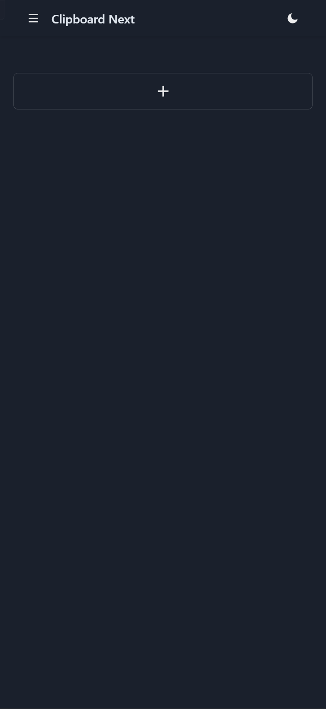
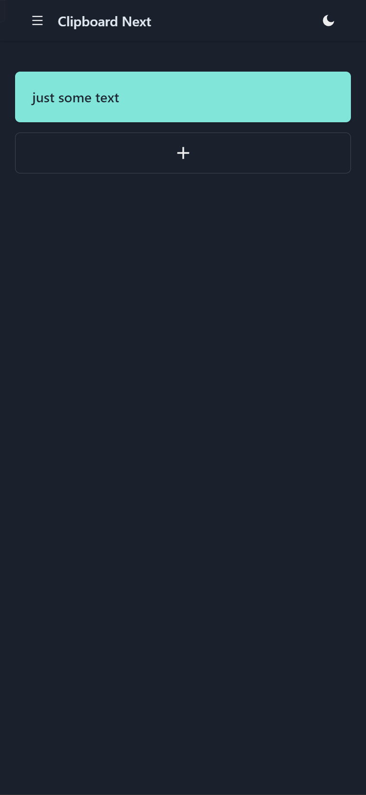
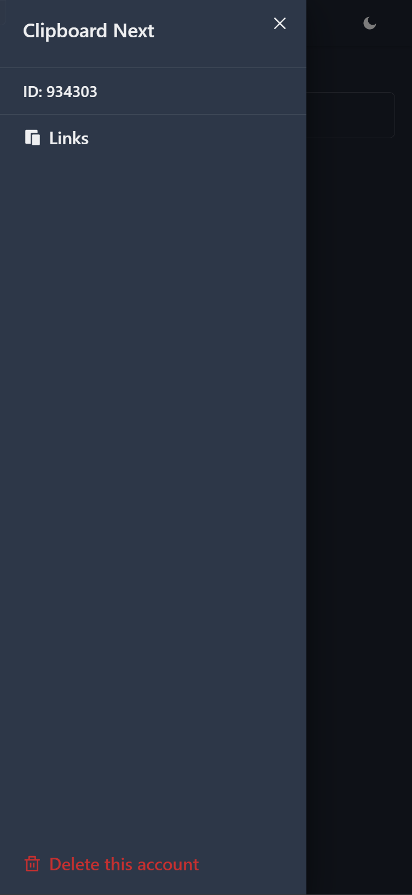
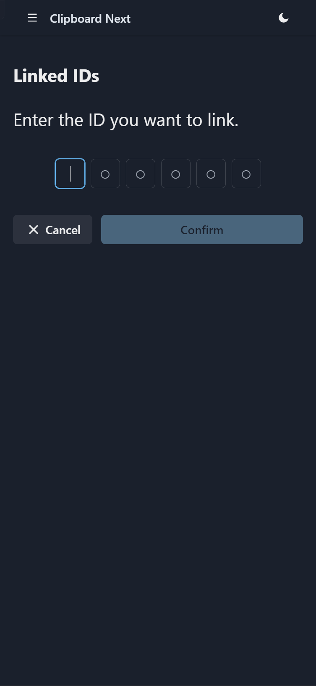
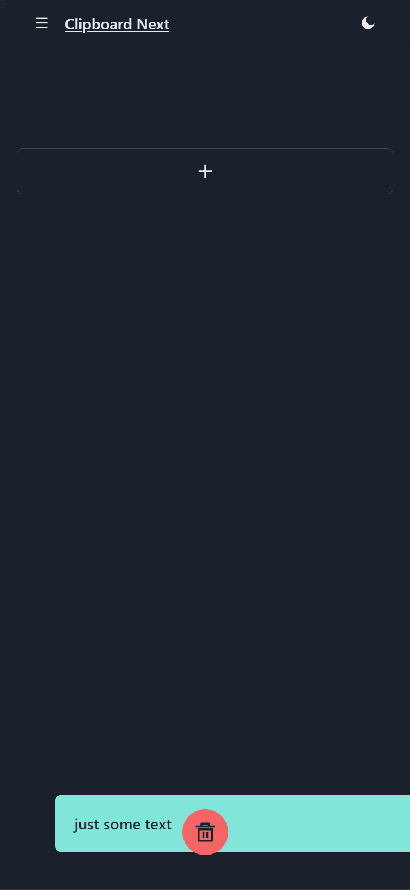

This is a [Next.js](https://nextjs.org/) project bootstrapped with [`create-next-app`](https://github.com/vercel/next.js/tree/canary/packages/create-next-app).

## Getting Started

First, run the development server:

```bash
yarn dev
```

# Environment variable

| variable | description |
| ------------------ | --------- |
|SERVERLESS_BASEURL|Serverless api, use `http://localhost:PORT/api/f` for development, `PORT` usually is `3000`, depend on your config. In production mode, set it to your domain with `/api/f`|
|REDIS_URL|Redis url for your app, you can use [aiven.io](https://console.aiven.io/) redis or others|

# introduction

**PREVIEW** https://clipboardnext.vercel.app/

> You can add you clipboard text or any other text easily.




> You can link to another devices easily
> 
> You can also copy the text from other devices





> Just use drag to delete you text easily


